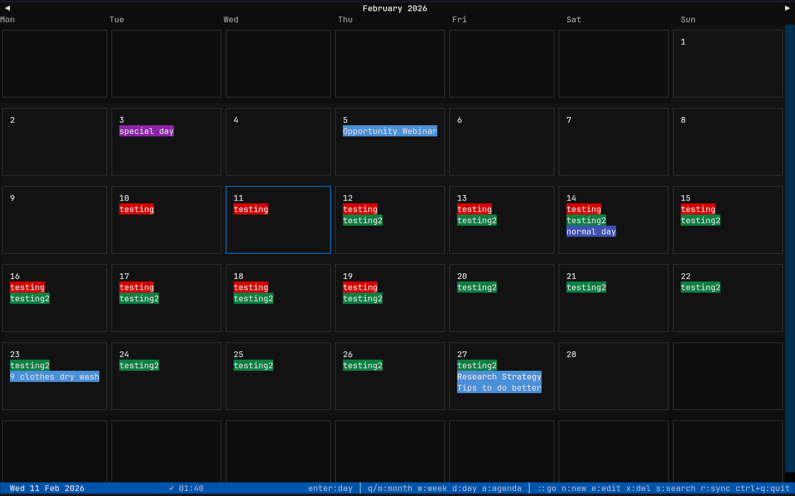
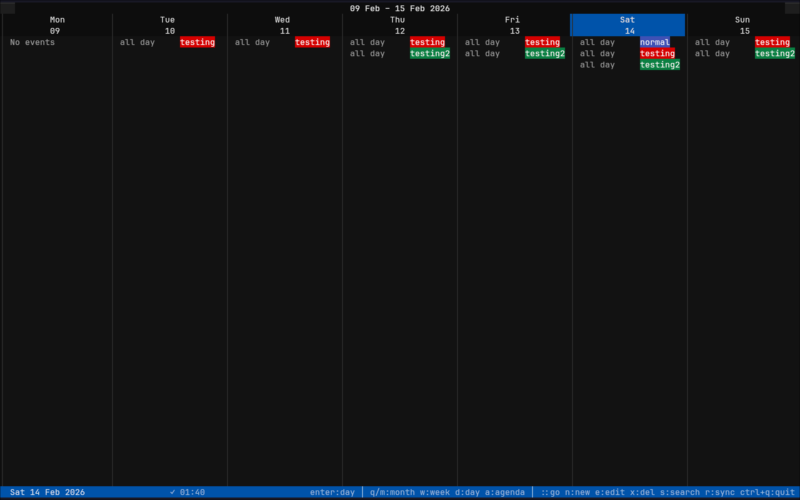
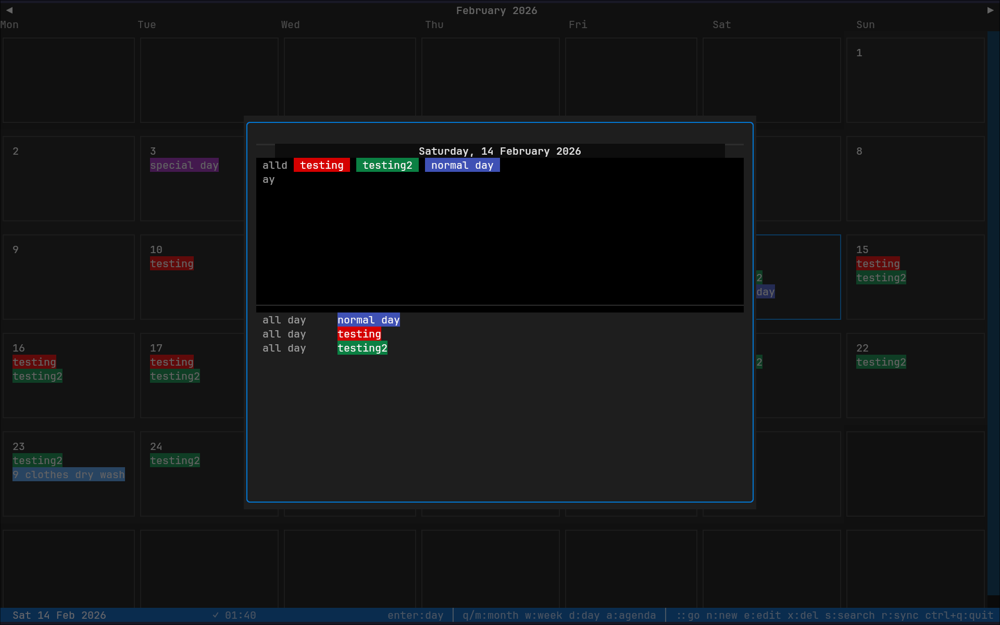

# caltui

Google Calendar in your terminal: a keyboard-driven TUI built with [Textual](https://textual.textualize.io/).


## Features

- **Four views**: Monthly, Weekly, Daily (modal), Agenda
- **Full CRUD**: create, edit, and delete calendar events without leaving the terminal
- **Google Tasks**: task due dates rendered alongside events
- **Search**: full-text search across all selected calendars
- **Disk cache**: data survives restarts; configurable TTL (default 5 min)
- **All 11 Google colors** rendered with contrast-safe text
- **Vim-style navigation**: `hjkl`, `[/]` period jumps, `:` date jump

## Screenshots

**Monthly view**


**Weekly view**


**Daily popup**


## Requirements

- Python 3.11+
- A Google account with Calendar and Tasks enabled
- A Google Cloud project with OAuth 2.0 credentials

## Installation

```bash
git clone git@github.com:crypticsaiyan/caltui.git
cd caltui
pip install -e .
```

For development (includes pytest):

```bash
pip install -e ".[dev]"
```

## Authentication Setup

caltui uses OAuth 2.0 (Desktop application flow). You only need to do this once.

**1. Create a Google Cloud project**

Go to [console.cloud.google.com](https://console.cloud.google.com/) and create a new project (or select an existing one).

**2. Enable the required APIs**

In the project, navigate to **APIs & Services → Library** and enable:
- Google Calendar API
- Tasks API

**3. Create OAuth credentials**

Navigate to **APIs & Services → Credentials → Create Credentials → OAuth client ID**.
- Application type: **Desktop app**
- Download the JSON file and save it as `credentials.json` in the project root.

**4. Run caltui**

```bash
caltui
```

On first launch a browser window opens for the OAuth consent screen. After granting access, the token is saved to `~/.config/caltui/token.json` (mode `0600`) and reused automatically. Tokens are refreshed silently when they expire.

> **Note:** The OAuth callback listens on ports 8080–8083. Make sure at least one is free during first-time auth.

## Usage

```bash
caltui
```

### Keyboard shortcuts

| Key | Action |
|-----|--------|
| `m` | Monthly view |
| `w` | Weekly view |
| `d` | Daily popup |
| `a` | Agenda view |
| `h` / `←` | Previous day |
| `l` / `→` | Next day |
| `k` / `↑` | Previous week (or previous item in Agenda) |
| `j` / `↓` | Next week (or next item in Agenda) |
| `[` | Previous month (Monthly) / previous week |
| `]` | Next month (Monthly) / next week |
| `t` | Jump to today |
| `:` | Jump to a specific date |
| `n` | New event |
| `e` | Edit selected event |
| `x` / `Delete` | Delete selected event |
| `Enter` | Open day popup / toggle event panel |
| `Esc` | Close event panel |
| `s` / `/` | Search events |
| `r` | Force refresh from Google |
| `?` | Help |
| `q` | Return to Monthly view |
| `Ctrl+Q` | Quit |

Press `?` inside the app for the same reference.

## Configuration

Edit `config/settings.toml` to customise behaviour:

```toml
[auth]
credentials_file = "credentials.json"   # path relative to project root

[calendar]
default_view = "monthly"                # monthly | weekly | agenda
week_starts_on = "monday"
working_hours_start = 8
working_hours_end = 18
timezone = ""                           # empty = system timezone

[display]
show_declined = false
show_tasks = true
max_event_chips_per_day = 3

[api]
max_results_per_page = 250
events_lookahead_days = 180
events_lookbehind_days = 60
cache_ttl_seconds = 300
```

## Project Structure

```
caltui/
├── main.py                  # Entry point: loads config, authenticates, starts app
├── models.py                # Dataclasses: CalEvent, GCalendar, Task, TaskList
├── pyproject.toml
├── config/
│   └── settings.toml        # User-editable config
├── auth/
│   └── oauth.py             # OAuth 2.0 flow, token storage/refresh
├── api/
│   ├── calendar.py          # Google Calendar API wrapper (with exponential backoff)
│   ├── tasks.py             # Google Tasks API wrapper
│   └── cache.py             # Disk cache (JSON, TTL-aware, window-aware)
├── ui/
│   ├── app.py               # CalTuiApp: root app, keybindings, data loading
│   ├── app.tcss             # Textual CSS
│   ├── messages.py          # Custom Textual messages
│   ├── theme.py             # Google color → hex mapping, contrast helpers
│   ├── views/
│   │   ├── monthly.py       # Monthly grid view
│   │   ├── weekly.py        # Weekly column view
│   │   ├── daily.py         # Day popup (modal)
│   │   └── agenda.py        # Scrollable agenda list
│   └── components/
│       ├── event_panel.py   # Side panel showing selected event details
│       ├── event_form.py    # Create / edit event modal
│       ├── delete_confirm.py
│       ├── search_modal.py
│       ├── date_jump_modal.py
│       ├── mini_calendar.py
│       ├── calendar_list.py
│       ├── help_modal.py
│       └── status_bar.py
└── tests/
    ├── test_calendar_list.py
    ├── test_date_jump.py
    └── test_theme.py
```

## Data & Privacy

| Path | Contents |
|------|----------|
| `~/.config/caltui/token.json` | OAuth access + refresh token (mode `0600`) |
| `~/.cache/caltui/cache.json` | Cached events, tasks, calendars |

No data is sent anywhere other than Google's APIs. Delete either file at any time; caltui recreates them on the next run.

## Development

```bash
# Run tests
pytest

# Run a single test file
pytest tests/test_theme.py -v
```

Tests use `pytest-asyncio` in `auto` mode; no `@pytest.mark.asyncio` decoration needed.

## Troubleshooting

**`credentials.json` not found**
Make sure the file is in the project root (or update `auth.credentials_file` in `settings.toml`).

**OAuth port already in use**
caltui tries ports 8080–8083. Free one of them and re-run.

**Stale data**
Press `r` to force a sync, bypassing the disk cache.

**`token.json` is invalid / revoked**
Delete `~/.config/caltui/token.json` and rerun; the OAuth flow will restart.

## License

MIT
